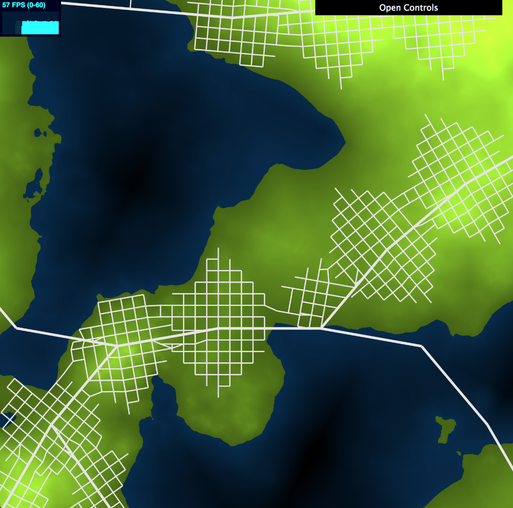
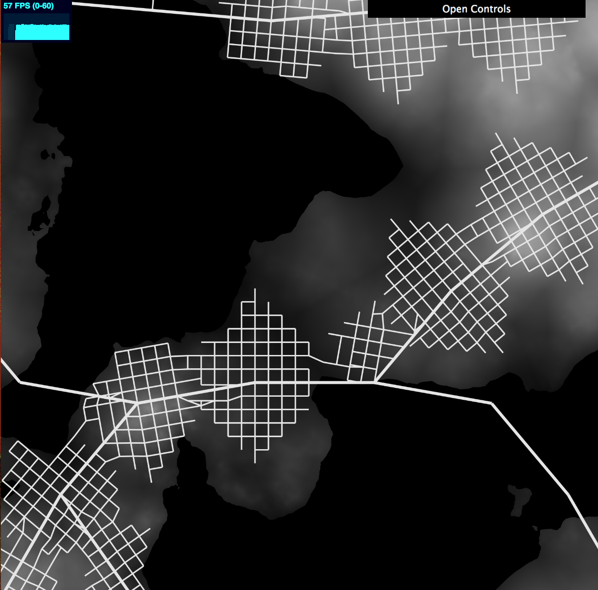
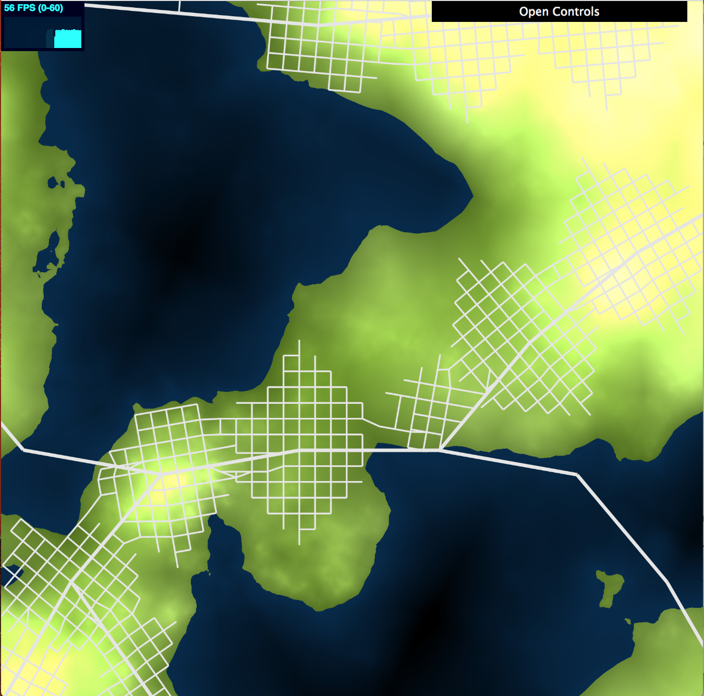
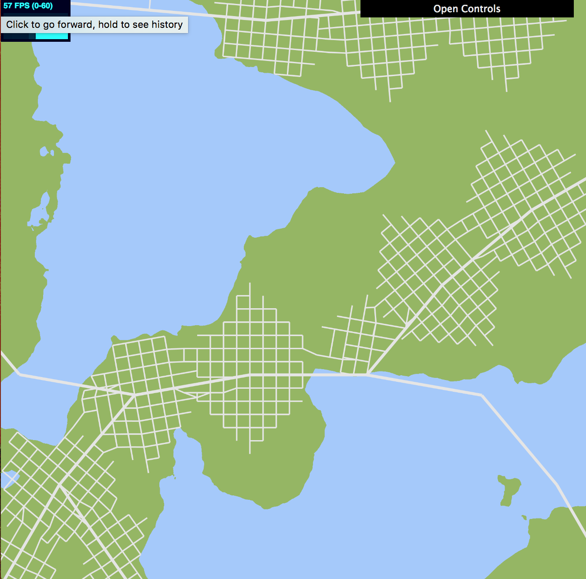
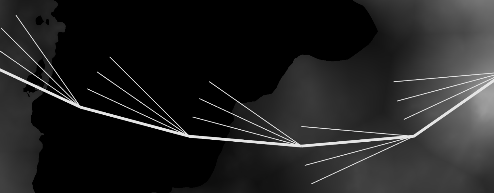
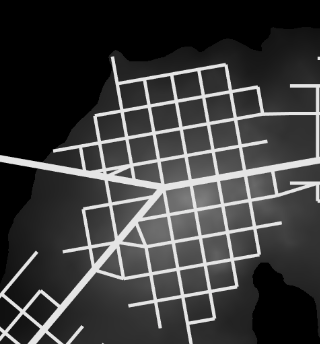
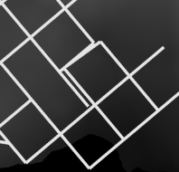
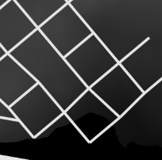

# Procedural Road Generation

### Chloe Le (chloele)
- https://chloele.com/

### Demo: 
- http://www.chloele.com/road-generation/

Note: please make sure to adjust the window to be a square view to see the full rendered output.

Terrain Map View: 

Population Map View:
 

Terrain Map + Population Map View:

Land vs. Water Map View: 
  

## References

This project is based on the paper [Procedural Modeling of Cities](https://github.com/chloele33/road-generation/blob/master/proceduralCityGeneration.pdf). 
Techniques for global and local constrains all follow the paper. 

For edge intersection, I referenced [slides](https://docs.google.com/presentation/d/e/2PACX-1vSXHVq2CajrWQT_OG0RULdZttOFukc8CMHGMe6Jt9mGOI5lpDoomY9PGJHoiZPq2U_32Uy_SzpXDSk-/pub?start=false&loop=false&delayms=60000&slide=id.g1e1b90fa28_0_451
) from UPenn's CIS460/560 course.

## Inspiration
This project is based on the paper [Procedural Modeling of Cities](https://github.com/chloele33/road-generation/blob/master/proceduralCityGeneration.pdf). 

## Features Implemented
- Use of noise (FBM and Worley) and texture to render the different map views
- Terrain elevation map
- Population density map
- Self-sensitive LSystem for highway and road generation
    - Main roads follow population density as a metric for directional bias
    - Checkered road networking
    - Overall system follows global and local constraints
- Instance rendering
- Interactive 

## Implementation

### Elevation Map
Elevation map is determined in the flat frag shader.  I am using 2DFBM noise to determine terrain elevation. 
After I get the output from my FBM function, I map the noise using a log function. Next, I compute terrain colors based on the 
pre-computed height map. When the height is below a certain level, say 0.1, it is water, else it is land. In addition, modulation of 
colors is done by multiplying a predetermined color with the height coefficient. 

### Population Map
Population map is determined in the flat frag shader.  I am using Worley noise with the terrain height's 2DFBM noise to determine population density. 
The Worley noise is used with a scaling coefficient, and then I am inverting the value by subtracting the worley result from 1. 
Then, the noise is considered with the pre-computed height map to say that population is more dense the farther away from water, and there is no population in water. 
Please note that population is more dense in lighter areas. The modulation of colors is done by multiplying a greyscale color with the population density noise. 

### Land vs. Water
This is simply done by taking away the modulation of colors in the terrain map -- when height is below the water level, color it all blue,
and when height is above the water level, color it all green.

### Texture
All maps mentioned above can be toggled on and off in the texture frag shader. In addition, population and terrain maps can be viewed alone or combined
together. To use the texture shader, I set up buffers and bindings in the main function. The steps include binding the texture, binding the frame buffer, 
binding render buffer, render to frame buffer, and finally, before running the LSystem, saving the texture to a Uint8Array as and use gl.readPixels to take in texture data.
Texture data is passed to the LSystem in order for the system to determine areas of high population density and differentiate between land vs. water. 
Please note that I made the dimension 2000 x 2000 for all shaders and viewports. So make sure to adjust the window to be a square view to see full result.

### Self-sensitive LSystem
- Main roads
    - First, we generate the highways with a few arbitrary points as starting points. Turtles are created with the starting points as their original positions, and the turtles 
    are saved to a turtle stack. While the stack is not empty, a turtle is popped off the stack. If the turtle is alive and depth is below a certain threshold, the turtle moves to create a new highway branch. 
    Whenever the turtle move, I am saving the movement as an edge and intersection, adding to the collection of edges and intersections in the class. The highway turtles follow the below constraints:
    - global constraints
        - Highways have the goal to centers of population. Therefore, to determine where to branch the highway, I am creating a directional bias towards areas 
        with higher population. To bias towards the population center, or center with higher population density based on the passed in texture data, I shoot out a number rays (in this case 4), starting from the turtle's orientation 
        and add a rotation of 10 degrees for each ray. These 'test feeler' rays will ask the texture map what is the population density at the current location. As a result, the point with the highest population density out of the four 
        is recorded and set as the "proposed" end point to connect to for the next highway branch. 
       See below, the bolded edges are the ones the LSystem ends up selecting:
         
       - Highways will create more turtles when the population density at an endpoint is close to the max-population density that has been visited so far. If that is the case, a few more turtles are generated at the endpoint location and pushed to the stack.
        Below is an area with higher population density, and resulted in a new fork of highway. 
                 
               
       - Stop the turtle if it is out of bounds. 

    - local constraints
        - two edges intersect -> prune the edge and generate a new crossing at the intersection.  
        - end close to an existing intersection -> extend street to snap to the intersection
        - end close to intersecting with a street -> extend the segment to actually intersect the street
- Grid roads
    - The grid system is generated after highway networks have been determined. For each of the intersections that are was added by the highway generation step, two turtles are 
    created -- one facing the left, and one facing the right. Then, the two turtles are pushed to to the road turtle stack. While the stack is not empty, we pop off of a turtle, and run the move road turtle function, which will follow the following contstraints: 
    - global constraints
        - Overall, the road grids formed are intersecting at roughly 90 degree angles. The idea is for each road turtle, it will move forward, move right, and move left, all at right angles, to generate potential end points for drawing edges. 
        After correcting the endpoints based on the local constraints below, new edges and intersections are pushed to the collections, and three new turtles are formed: 
        these three turtles are formed at the three new end points, created, and they will then do the same with generating new edges and turtles. 
        - The turtles continue to grow until they have reached iteration limit or out of bounds. 
        - Road turtle stop moving once it detects that it is in the ocean by calling texture map's getElevation function. 
    - local constraints
        - two edges intersect -> prune the edge and generate a new crossing at the intersection.  
        - end close to an existing intersection -> extend street to snap to the intersection. How far to search for is based on the "snap coefficient", which can be adjusted by the user. 
        before and after snapping: 
                          
        - end close to intersecting with a street -> extend the segment to actually intersect the street. How far to test the extension is based on the "extension coefficient", which can be adjusted by the user. 
        before and after extending   
                          

### Instanced Rendering
The road network is rendered using instanced rendering. Instanced shader takes in four transformations' columns from our geometry. Other classes such as Drawable, Square, and ShaderProgram all have been modified to adapt to instanced rendering. 
They now save the transformation matrix's columns as four vec4's, and extra buffers for the four columns are generated and binded.

To render the road network, I am getting VBO data from LSystem's getVBO() function. This function basically considers all edges in one go, and returns the four column arrays and colors array from all the edges' transformation data. 
In the Edge class, we can get each edge's transformation matrix by using the getTransform() function. 

### Interactive GUI
The user can interact with
  - different map views (which are uniform toggle booleans sent to the shaders)
  - highway length, road length, number of iterations
  - local constraint coefficients for snap and extending road segments. The bigger the coefficients, the longer the serach distance and tendency to snap/extend the segment. 

 
