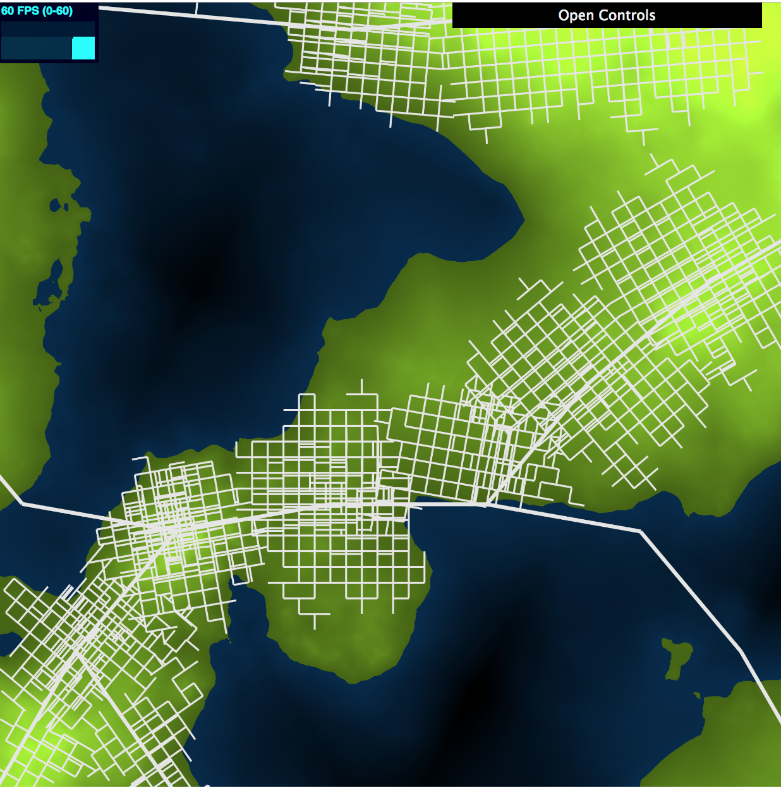
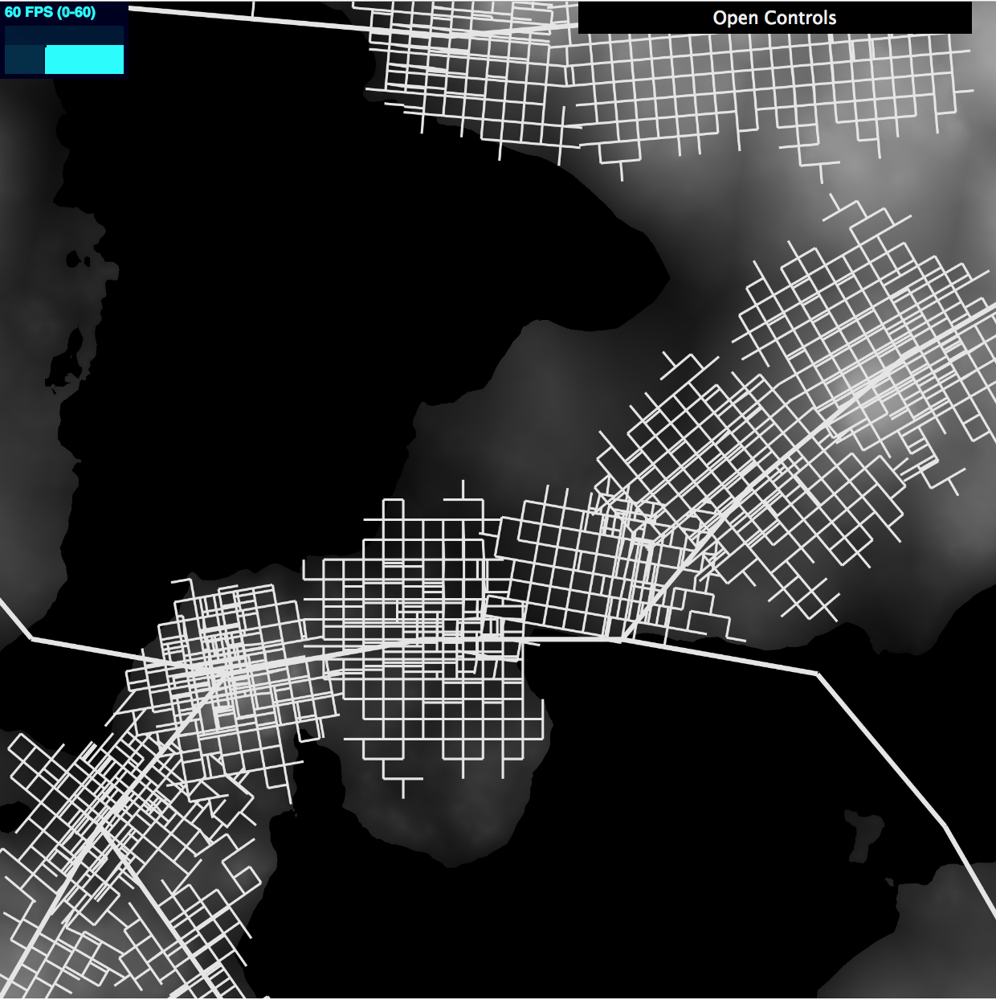
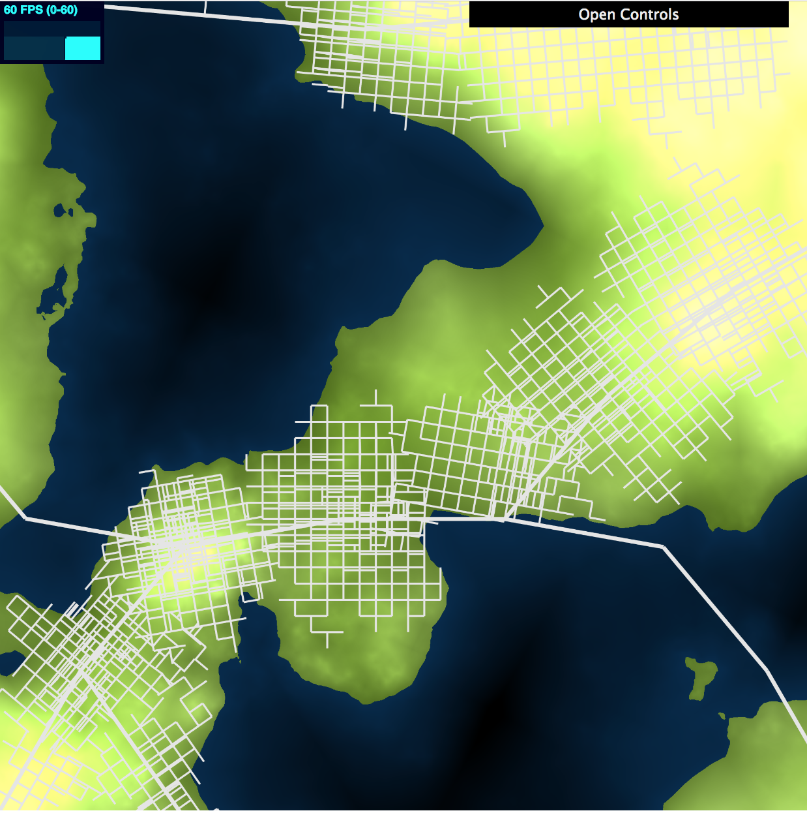
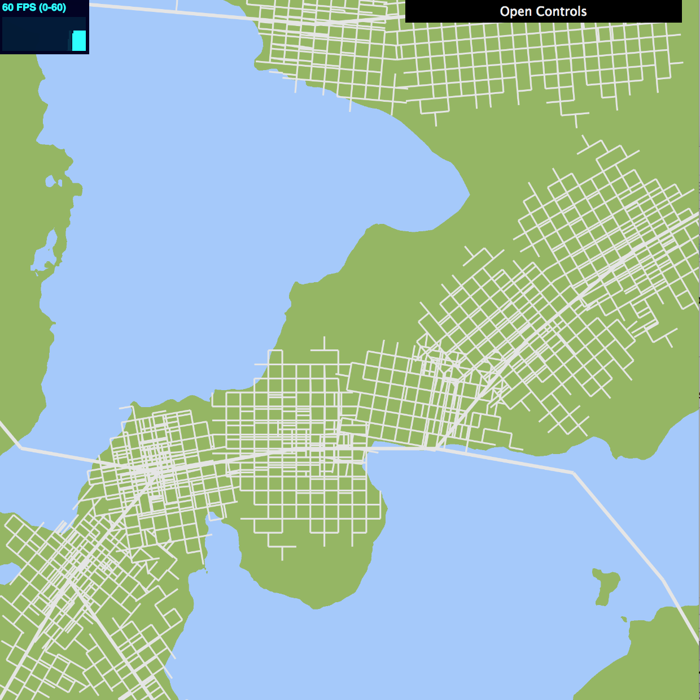

# Procedural Road Generation

### Chloe Le (chloele)
- https://chloele.com/

### Demo: 
- http://www.chloele.com/road-generation/

Terrain Map View: 

Population Map View:
 

Terrain Map + Population Map View:

Land vs. Water Map View: 
  

## References

This project is based on the paper [Procedural Modeling of Cities](https://github.com/chloele33/road-generation/blob/master/proceduralCityGeneration.pdf). 
Techniques for global and local constrains all follow the paper. 

For edge intersection, I referenced [slides](https://docs.google.com/presentation/d/e/2PACX-1vSXHVq2CajrWQT_OG0RULdZttOFukc8CMHGMe6Jt9mGOI5lpDoomY9PGJHoiZPq2U_32Uy_SzpXDSk-/pub?start=false&loop=false&delayms=60000&slide=id.g1e1b90fa28_0_451
) from UPenn's CIS460/560 course.

## Inspiration
This project is based on the paper [Procedural Modeling of Cities](https://github.com/chloele33/road-generation/blob/master/proceduralCityGeneration.pdf). 

## Features Implemented
- Use of noise (FBM and Worley) and texture to render the different map views
- Terrain elevation map
- Population density map
- Self-sensitive LSystem for highway and road generation
    - Main roads follow population density as a metric for directional bias
    - Checkered road networking
    - Overall system follows global and local constraints
- Instance rendering
- Interactive 

## Implementation

### Elevation Map
Elevation map is determined in the flat frag shader.  I am using 2DFBM noise to determine terrain elevation. 
After I get the output from my FBM function, I map the noise using a log function. Next, 

### Population Map

### Texture

### Self-sensitive LSystem

### Instance Rendering

### Interactive GUI
The user can interact with
  - different map views (which are uniform toggle booleans sent to the shaders)
  - highway length, road length, number of iterations
  - local constraint coefficients for snap and extending road segments

 
